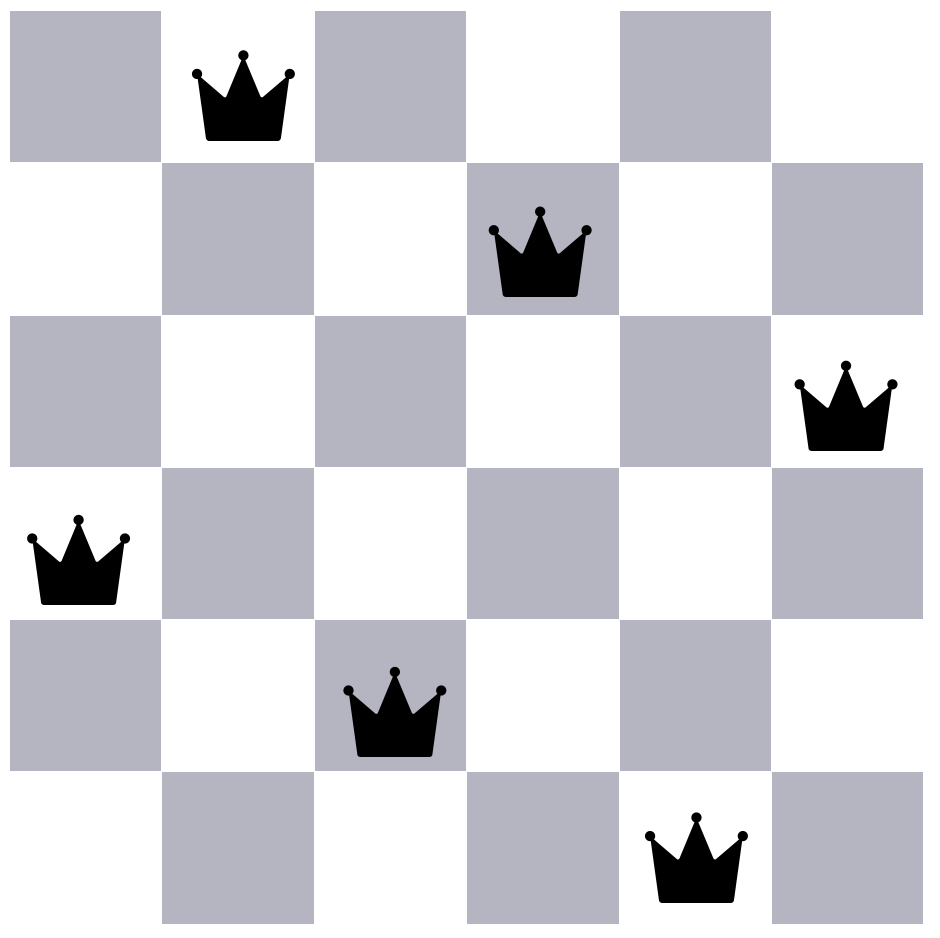

# N Reinas

N-Queens

## Definición del problema

El problema de las $n$-Reinas consiste en encontrar una distribución de $n$  reinas en un tablero de $n \times n$ de modo tal, que éstas no se ataquen. Así, que no pueden encontrarse dos reinas en la misma fila, columna o diagonal.

Este problema tiene dos versiones. La versión más simple consiste en encontrar exactamente **una solución válida para un valor $n$  dado**. La otra versión más difícil, consiste en encontrar **todas las soluciones posibles para un valor $n$**.

Se puede observar que este problema tiene una solución $(Q(1)=1)$ para $n=1$, no tienen solución para $n=2$ y $n=3$ y tiene 2 soluciones para $n=4$. La Tabla 1 muestra el número total de soluciones $Q(n)$ para $4 \le n \le 20$.

Para solucionar este problema se han diseñado soluciones con recocido simulado, algoritmos genéticos, búsqueda local con resolución de conflictos, programación entera y redes neuronales, entre otros.

En cuanto a la complejidad del problema de las $n$ reinas, pertenece a la clase de problemas NP-completos, pero se resuelve fácilmente en tiempo polinomial cuando solamente se busca una solución.

Tabla 1. Número total de soluciones $Q(n)$ para $4 \le n \le 20$

| $n$    |  $Q(n)$      |
|--------|--------------|
| 4      |  2           |
| 5      |  10           |
| 10     |  724           |
| 15     |  2, 279, 184           |
| 20     |  39,029,188,884           |

## Aplicaciones

El problema de las $n$-reinas es conocido usualmente como un problema propio para probar nuevos algoritmos. Sin embargo, existen algunas aplicaciones ya que se le considera un modelo  de máxima cobertura. Una solución al problema de las $n$-reinas garantiza que cada objeto puede ser accesado desde cualquiera de sus ocho direcciones vecinas (dos verticales, dos horizontales y cuatro diagonales) sin que tenga conflictos con otros objetos.

Algunas aplicaciones son:

- Sistemas de control de tráfico aéreo
- Sistemas de comunicaciones
- Programación de tareas computacionales
- Procesamiento paralelo óptico
- Balance de carga en un computador multiprocesador
- Ruteo de mensaje o datos en un computador multiprocesador

## Ejemplo

El problema particular de las $n$-reinas con $n=6$ consiste entonces en colocar 6 reinas en un tablero de $6 \times 6$ sin que ellas se ataquen. Se sabe que para este caso existen cuatro soluciones válidas, las que se representan en la Figura 2.


## Modelo

En el problema de las $n$-reinas tiene al menos dos modelos asociados que cumplen con lo siguiente:

- La función objetivo no tiene un uso práctico ya que se sabe a priori el valor de $n$.
- Dos reinas no pueden estar en la misma fila
- Dos reinas no pueden estar en la misma columna
- Dos reinas no pueden estar en la misma diagonal

Las diagonales serán consideradas de acuerdo al signo de su pendiente. Por lo que se tendrán diagonales positivas y negativas. Al definir el número de reinas y el tamaño del tablero de ajedrez con $n$, con  $n= \{1, 2, \ldots, n\}$.

La cantidad de formas de modelar el problema son pocas, este modelos resuelven o se desarrollan de muchas formas y con métodos distintos.

## Especificación

Se utilizar la variable $x_i$ para representar la posición de la reina en la fila $i$. En este caso, el dominio de $x_i$ sería $\{1, \ldots, n\}$. Las restricciones abarcan las columnas y todas las diagonales, sin distinguir entre positivas y negativas. Las filas se verifican por defecto, al tener que asignársele un valor a la variable. En decir, por la forma del modelo, no puede haber dos reinas en la mima fila, por lo que esta restricción se omite.

La restricción de las columnas impide que existan dos reinas en la misma columna. Esto se verifica al generar soluciones que sean permutaciones de $n$.

Ahora solo es necesario verificar que se cumpla la restricción de las diagonales. Esta restricción se puede resumir de la siguiente forma:

$|x_i -x_j| \neq |i-j| \, \forall i \neq j \text{ con } i \text{ y } j \in N$

Este modelo reduce el espacio de búsqueda.

## Representación de la solución

Para representar una solución de la Figura 1. se utiliza entonces un arreglo de tamaño $n=6$ de la siguiente forma

````python
actual_solution = [2, 4, 6, 1, 3, 5]
````



Figura 5. Representación de una de las soluciones al problema de 6-reinas.

## Generación de una solución vecina

Para generar una solución vecina se seleccionan de manera arbitraria dos reinas y se intercambian, es decir, se generan dos números aleatorios diferentes del dominio $\{1, 2, \ldots, n\}$ que representaran a las reinas seleccionadas. 

Ejemplo para la solución actual

```python
actual_solution = [2, 4, 6, 1, 3, 5]
```

Suponer que los números aleatorios generados son [f](https://latex.codecogs.com/png.image?\dpi{110}r_1%20=%204) $r_1 = 4$ y $r_2 = 2$. Entonces la solución vecina es:

```python
actual_vecina = [2, 1, 6, 4, 3, 5]
```

La Figura 6 muestra de manera gráfica el proceso realizado para construir una solución vecina.


Figura 6. Generación de solución vecina por intercambio.

## Función de costo

```python
def cost(r) {
	h = 0;

	for i in range(len(r):
		for j in range( i + 1, len(r)):
			if abs(r[i] - r[j]) == j - i:
				h += 1
	return h
```

## Instancias a ejecutar

- 100 reinas
- 5000 reinas
- 3,000,000 reinas
